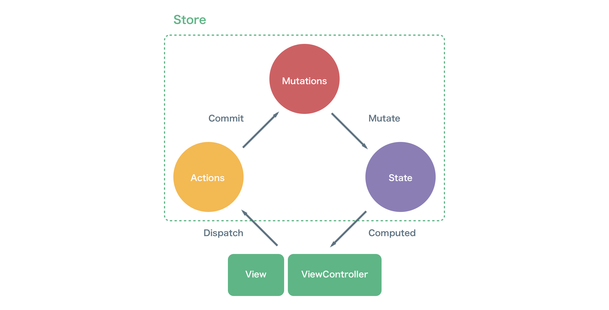

<H1 align="center">VueFlux</H1>
<H4 align="center">
Unidirectional Data Flow State Management Architecture for Swift - Inspired by <a href="https://github.com/vuejs/vuex">Vuex</a> and <a href="https://github.com/facebook/flux">Flux</a>
</H4>
</br>

<p align="center">
<a href="https://developer.apple.com/swift"></a>
<a href="https://travis-ci.org/ra1028/VueFlux"></a>
<a href="https://codebeat.co/projects/github-com-ra1028-vueflux-master"></a>
<a href="https://cocoapods.org/pods/VueFlux"></a>
<a href="https://github.com/Carthage/Carthage"></a>
<a href="https://developer.apple.com/swift/"></a>
<a href="https://github.com/ra1028/VueFlux/blob/master/LICENSE"></a>
</p>

---

## Introduction
VueFlux is the architecture to manage state with unidirectional data flow for Swift, inspired by [Vuex](https://github.com/vuejs/vuex) and [Flux](https://github.com/facebook/flux).  

It serves multi store, so that all ViewControllers have designated stores, with rules ensuring that the states can only be mutated in a predictable fashion.  

The stores also can receives an action dispatched globally. That makes ViewControllers be freed from dependencies among them. And, a shared state in an application is also supported by making a shared instance of the store.  

Although VueFlux makes your projects more productive and codes more readable, it also comes with the cost of more concepts and boilerplates.  
If your project is small-scale, you will most likely be fine without VueFlux.  
However, as the scale of your project becomes larger, VueFlux will be the best choice to handle the complicated data flow.  

VueFlux is receives state changes by efficient reactive system. [VueFluxReactive](./VueFluxReactive) is µ reactive framework(not functional) compatible with this architecture.  
Arbitrary third party reactive frameworks (e.g. [RxSwift](https://github.com/ReactiveX/RxSwift), [ReactiveSwift](https://github.com/ReactiveCocoa/ReactiveSwift) and [ReactiveKit](https://github.com/ReactiveKit/ReactiveKit)) can also be used with VueFlux.  



---

## About VueFlux
VueFlux makes a unidirectional and predictable flow by explicitly dividing the roles making up the ViewController.
It's constituted of following core concepts.  
State changes are observed by the ViewController using the reactive system.  
Sample code uses VueFluxReactive which will be described later.  
You can see example implementation [here](./Examples/Example).  

- [State](#state)
- [Actions](#actions)
- [Mutations](#mutations)
- [Computed](#computed)
- [Store](#store)

### State
This is the protocol that only just for constraining the type of Action and Mutations, represents the state managed by the Store.  
Implement some properties of the state, and keeps them readonly by fileprivate access control, like below.   
Will be mutated only by Mutations, and the properties will be published only by Computed.  

```swift
final class CounterState: State {
    typealias Action = CounterAction
    typealias Mutations = CounterMutations

    fileprivate let count = Variable(0)
}
```

### Actions
This is the proxy for functions of dispatching Action.  
They can have arbitrary operations asynchronous such as request to backend API.  
The type of Action dispatched from Actions' proxied functions is determined by State.  

```swift
enum CounterAction {
    case increment, decrement
}
```
```swift
extension Actions where State == CounterState {
    func increment() {
        dispatch(action: .increment)
    }

    func decrement() {
        dispatch(action: .decrement)
    }
}

```

### Mutations
This is the protocol that represents `commit` function that mutate the state.  
Be able to change the fileprivate properties of the state by implementing it in the same file.  
The only way to actually change State in a Store is committing an Action via Mutations.  
Changes of State must be done `synchronously`.  

```swift
struct CounterMutations: Mutations {
    func commit(action: CounterAction, state: CounterState) {
        switch action {
        case .increment:
            state.count.value += 1

        case .decrement:
            state.count.value -= 1
        }
    }
}
```

### Computed
This is the proxy for publishing read-only properties of State.  
Be able to access and publish the fileprivate properties of state by implementing it in the same file.  
Properties of State in the Store can only be accessed via this.  

```swift
extension Computed where State == CounterState {
    var count: Constant<Int> {
        return state.count.constant
    }
}
```

### Store
The Store manages the state, and also can be manage shared state in an application by shared store instance.  
Computed and Actions can only be accessed via this. Changing the state is the same as well.  
An Action dispatched from the `actions` of the instance member is mutates only the designated store's state.  
On the other hand, an Action dispatched from the `actions` of the static member will mutates all the states managed in the stores which have same generic type of State in common.  
Store implementation in a ViewController is like as follows:  

```swift
final class CounterViewController: UIViewController {
    @IBOutlet private weak var counterLabel: UILabel!

    private let store = Store<CounterState>(state: .init(), mutations: .init(), executor: .queue(.global()))

    override func viewDidLoad() {
        super.viewDidLoad()

        store.computed.count.signal
            .map { String($0) }
            .observe(on: .mainThread)
            .bind(to: counterLabel, \.text)
    }

    @IBAction func incrementButtonTapped(sender: UIButton) {
        store.actions.increment()  // Store<CounterState>.actions.increment()
    }

    @IBAction func decrementButtonTapped(sender: UIButton) {
        store.actions.decrement()  // Store<CounterState>.actions.decrement()
    }
}
```

---

## About VueFluxReactive
VueFluxReactive is a μ reactive system for observe state changes.  
It was made for replacing the existing reactive framework that have high learning and introduction costs such as RxSwift and ReactiveSwift.  
However, it's not included in VueFlux so that can also be use VueFlux with other high powered third-party reactive framework.  
VueFluxReactive is constituted of following primitives.  

- [Variable](#variable)
- [Constant](#constant)
- [Sink](#sink)
- [Signal](#signal)

### Sink
This primitive is a way of generating signal.  
One can send input values into a sink and receives values via generated signal.  
Signals generated from Sink does not hold the latest value.  
It's usually used to send instructions from State to ViewController (such as presents another ViewController).  

```swift
let sink = Sink<Int>()
let signal = sink.signal

signal.subscribe { print($0) }

sink.send(value: 100)

// prints "100"
```

### Signal
A push-driven stream that sends value changes over time.  
Can be subscribe values stream, and values will be sent to all observers at the same time.  
All observations of the values are made via this primitive.  

```swift
let sink = Sink<Int>()
let signal = sink.signal

signal.subscribe { print("1: \($0)") }
signal.subscribe { print($2: \($0)") }

sink.send(value: 100)
sink.send(value: 200)

// prints "1: 100"
// prints "2: 100"
// prints "1: 200"
// prints "2: 200"
```

### Variable
Variable represents a thread-safe mutable value that allows observation of its changes via signal.  
Signal generated from Variable is forwards the latest value when start observing, all value changes are delivers on after that.  

```swift
let variable = Variable(0)

variable.signal.subscribe { print($0) }

variable.value = 1

print(variable.value)

variable.signal.subscribe { print($0) }

/// prints "0"
/// prints "1"
/// prints "1"
```

### Constant
This is primitive that wrapper to make the Variable read-only.  
Just like Variable, the latest value and value changes are forwarded via signal, but not allowed to change the value directly.  
Constant generated from Variable reflects the changes of its Variable.  

```swift
let variable = Variable(0)
let constant = variable.constant

constant.signal.subscribe { print($0) }

variable.value = 1

print(constant.value)

constant.signal.subscribe { print($0) }

/// prints "0"
/// prints "1"
/// prints "1"
```

---

## Advanced Usage

### Executor
Executor determines the execution behavior of function such as execute on main-thread, on a global queue and so on.  
It has some behavior by default.  

- immediate  
  Executes function immediately and synchronously.  

- mainThread  
  Executes immediately and synchronously if execution thread is main-thread. Otherwise enqueue to main-queue.  

- queue(_ dispatchQueue: DispatchQueue)  
  All functions are enqueued to given dispatch queue.  

In the following case, the store commits actions to mutations through the global queue.  

```swift
let store = Store<CounterState>(state: .init(), mutations: .init(), executor: .queue(.global()))
```

If you subscribe like below, the observer function is executed on the main thread.  
The argument default is `mainThread`.  

```swift
store
    .observe(on: .mainThread)
    .subscribe { count in
    // Executed on the main thread
}
```

### Signal Operators
VueFluxReactive is restricts functional approach as much as possible.  
However, includes minimum some operators for convenience.  
These operators transform a signal into a new sinal.  

__map__  
The map operator is used to transform the values in a signal, creating a new signal.  

```swift
let sink = Sink<Int>()
let signal = sink.signal

signal
    .map { "Value is \($0)" }
    .subscribe { print($0) }

sink.send(value: 100)
sink.send(value: 200)

// prints "Value is 100"
// prints "Value is 200"
```

__observe(on:)__  
Forwards all values ​​on the context of the given Executor.  

```swift
let sink = Sink<Int>()
let signal = sink.signal

signal
    .observe(on: .mainThread)
    .subscribe { print("Value: \($0), isMainThread: \(Thread.isMainThread)") }

DispatchQueue.global().async {
    sink.send(value: 100)    
    sink.send(value: 200)
}

// prints "Value: 100, isMainThread: true"
// prints "Value: 200, isMainThread: true"
```

### Subscription
Subscribing to the store returns Subscription.  
Subscription has `unsubscribe` function which can remove an observer function that is subscribing to the store.  

```swift
let subscription = store.computed.count.signal.subscribe { count in
    // NOT executed after unsubscribed.
}

subscription.unsubscribe()
```

### SubscriptionScope
SubscriptionScope serves as resource manager of subscription.  
This will terminate all added subscriptions on deinitialization.  
For example, when the ViewController which has a property of SubscriptionScope is dismissed, all subscriptions are terminated.  

```swift
var subscriptionsScope: SubscriptionScope? = SubscriptionScope()

subscriptionScope += store.computed.count.signal.subscribe { count in
    // NOT executed after subscriptionsScope had deinitialized.
}

subscriptionsScope = nil  // Be unsubscribed
```

### Scoped Subscribe
In subscribing, you can pass `AnyObject` as the parameter of `duringScopeOf`.  
An observer function which is subscribed to the store will be unsubscribe when deinitializes its object.  

```swift
store.computed.count.signal.subscribe(duringScopeOf: self) { count in
    // NOT executed after `self` had deinitialized.
}
```

### Bind
By binding, the target object's value is updated to the latest value sent by the Signal.  
Bindings are not updated after the target object is deinitialized.  

Closure binding.
```swift
store.computed.text.signal
    .observe(on: .mainThread)
    .bind(to: label) { label, text in label.text = text }
```

Smart KeyPath binding.
```swift
store.computed.text.signal
    .observe(on: .mainThread)
    .bind(to: label, \.text)
```

Binder binding.
```swift
extension UIView {
    func setHiddenBinder(duration: TimeInterval) -> Binder<Bool> {
        return Binder(target: self) { view, isHidden in
            UIView.transition(
              with: view,
              duration: duration,
              options: .transitionCrossDissolve,
              animations: { view.isHidden = isHidden }
            )
        }
    }
}

store.computed.isViewHidden.signal
    .observe(on: .mainThread)
    .bind(to: view.setHiddenBinder(duration: 0.3))
```

### Shared Store
You should make a shared instance of Store in order to manages a state shared in application.  
Although you may define it as a global variable, an elegant way is overriding the Store and defining a static member `shared`.  

```swift
final class CounterStore: Store<CounterState> {
    static let shared = CounterStore()

    private init() {
        super.init(state: .init(), mutations: .init(), executor: .queue(.global()))
    }
}
```

### Global Event Bus
VueFlux can also serve as a global event bus.  
If you call a function from `actions` that is a static member of Store, all the states managed in the stores which have same generic type of State in common are affected.  

```swift
let store = Store<CounterState>(state: .init(), mutations: .init(), executor: .immediate)

print(store.computed.count.value)

Store<CounterState>.actions.increment()

print(store.computed.count.value)


// prints "0"
// prints "1"
```
---

## Requirements
- Swift4.0 or later
- OS X 10.9 or later
- iOS 9.0 or later
- watchOS 2.0 or later
- tvOS 9.0 or later

---

## Installation

### [CocoaPods](https://cocoapods.org/)  
Add the following to your Podfile:  
```ruby
use_frameworks!

target 'TargetName' do
  pod 'VueFlux'
end
```
And run
```sh
pod install
```

### [Carthage](https://github.com/Carthage/Carthage)  
Add the following to your Cartfile:  
```ruby
github "ra1028/VueFlux"
```
And run
```sh
carthage update
```

---

## Contribution
Welcome to fork and submit pull requests.  

Before submitting pull request, please ensure you have passed the included tests.  
If your pull request including new function, please write test cases for it.  

---

## License
VueFlux is released under the MIT License.  

---